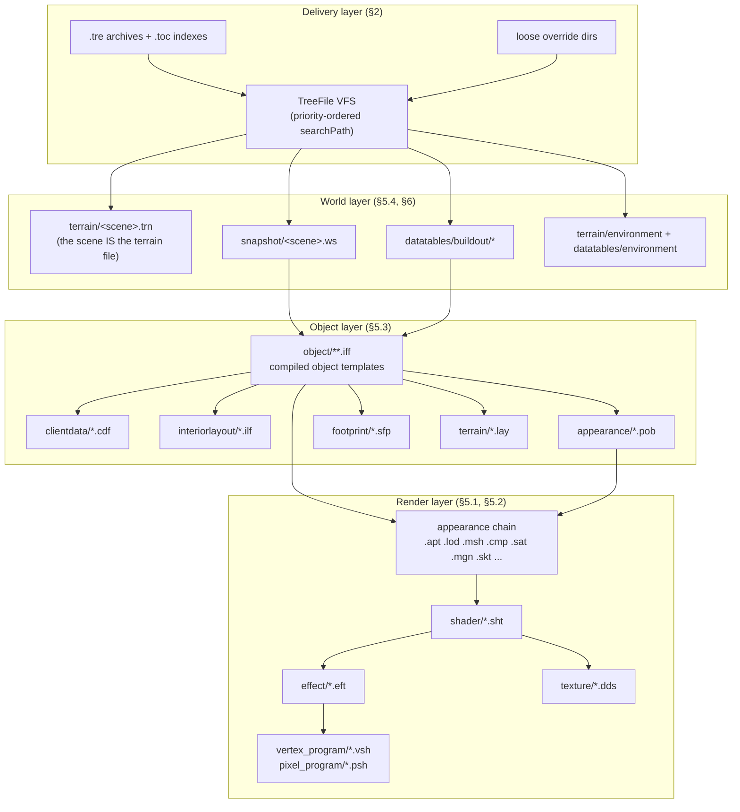
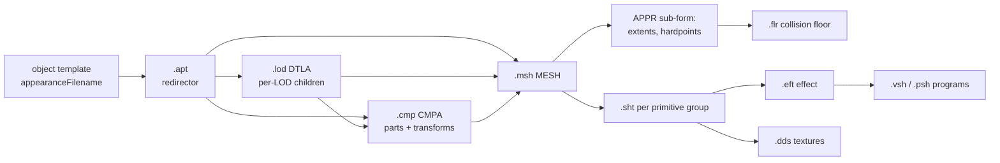
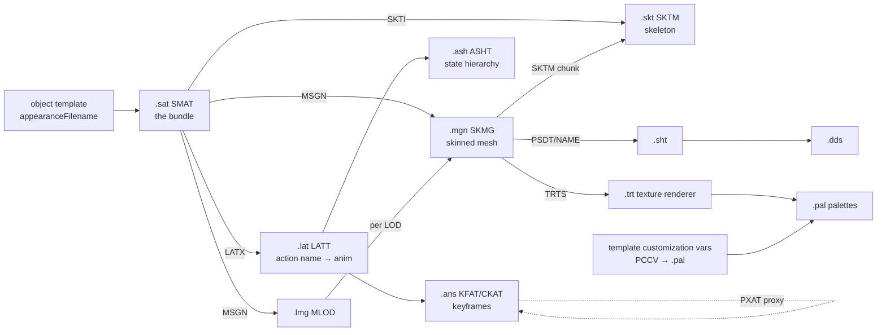
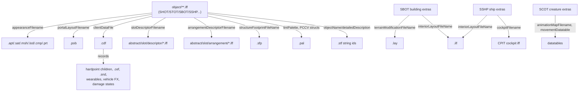
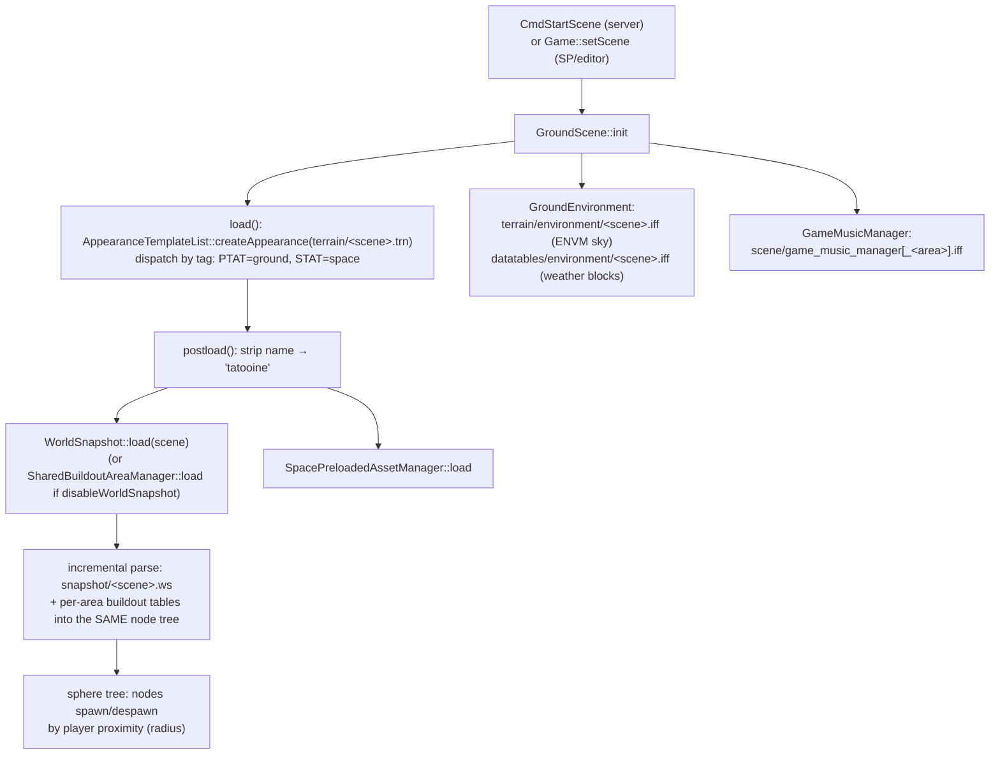
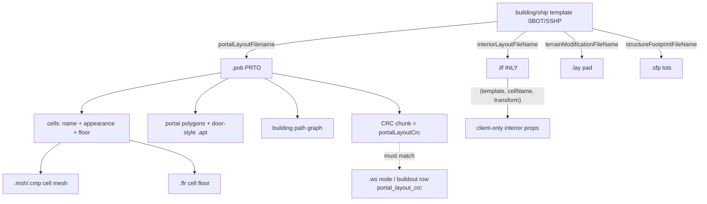
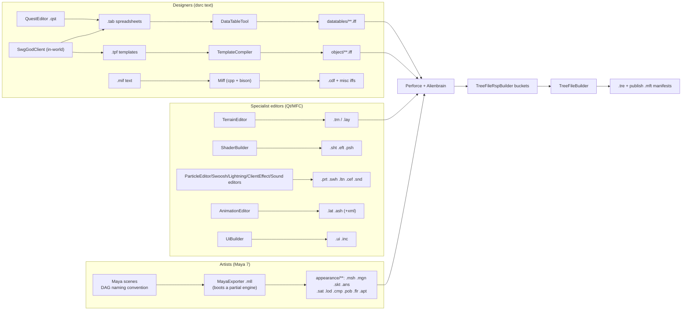

# SWG Asset File Formats, Composition & Modern Editing Guide

**Purpose:** the definitive reference for building SWG-Toolkit — every asset extension the client
loads, what it is, how formats compose into larger units, how SOE authored them, and how we edit
them today (including editing multi-file composites as a unit).

**Method:** all claims verified 2026-08-01 against (a) the engine source in this repo
(`src/engine`, `src/game`), (b) a full census of the live client data
(`D:\Code\SWGSource Client v3.0\sku0_client.toc` — 193,475 files), and (c) the sibling repos
(`swg-main` dsrc, `swg-blender-plugin`, `SWG-Toolkit`, `swg-client` era-binary drop). `file:line`
citations are from the working tree on that date; line numbers drift, form tags don't.
Corrections to older docs in this directory are collected in §12.

---

## 1. The data stack at 30,000 feet



Everything the client renders resolves through this stack. Two load-bearing facts shape all
modding work:

1. **A "scene" IS a terrain file.** There is no scene manifest; `sceneId` is derived by
   stripping `terrain/<name>.trn` (Game.cpp:1711-1732). Everything else (snapshot, buildout,
   environment) is keyed off that stripped name.
2. **Dispatch is by IFF form tag, not file extension** (with one exception, `.apt`).
   Extensions are conventions; the engine opens the file and switches on the first FORM tag.

---

## 2. Delivery layer — TRE/TOC archives and the search path

### 2.1 How content ships

| Piece | Format | Notes |
|---|---|---|
| `.tre` | `TREE` token + version `0004`/`0005` (retail), 24-byte TOC entries, zlib-compressed blocks, MD5 tail | The unit of content delivery. No in-place patch API — updates ship as **new higher-priority archives**. |
| `.toc` (SearchTOC) | Master index over many `.tre` files (`TAG_TOC`/`0001` retail; ASCII `COT2000` in Restoration; v6000 variant uses 32-byte entries + encrypted payloads) | One index, data blocks live inside the member `.tre` files. **Any "what does the client load" sweep must walk the TOC layer** — per-tre scans are structurally blind to TOC-resolved files (this bit us twice in-project). |
| loose files | plain directories | Highest-priority override mechanism; how dev/mod iteration works. |

### 2.2 The live search path (this checkout's `stage/client.cfg`)

```
searchTOC_00_0..3   = sku0..sku3_client.toc      (lowest priority: the retail content)
searchPath_00_5     = stage/ilm_extract          (ILM/Legends extracted layer)
searchTree_00_7,8   = disable_wayfar_dearic_snow.tre, swgsource_3.0.tre
searchPath_00_9     = <install root>             (loose files in the install)
searchPath_00_10    = stage/override             (HIGHEST priority: dev/mod overrides)
```

`TreeFile.cpp:109-156` reads `searchPath/searchTree/searchTOC` keys at priorities 0..20; higher
priority wins per-file. **This is the mod delivery model**: iterate with loose files in an
override dir, ship as a `.tre` mounted at higher priority than stock. The sku layering
(sku.0 base / sku.1 JTL / sku.2 RotW / sku.3 ToOW) is the same mechanism.

Modding traps at this layer:
- The **searchPath negative cache** (project addition, `[SharedFile] searchPathNegativeCache`)
  makes a mid-session loose-file *addition* invisible until restart or explicit
  `TreeFile::forgetMissingFile` (the engine's `wsSaveSnapshot` does this for its own output).
- Writing `.cfg` files with PowerShell `Set-Content` adds a UTF-8 BOM that **crashes the release
  client at boot** (project memory; use BOM-safe writers).
- v6000/Restoration archives have encrypted payloads — enumerate-only from generic tools.

### 2.3 The dsrc convention (source vs compiled data)

The original pipeline keeps human-readable sources in a `dsrc/` tree and compiles into a parallel
`data/` tree — the compilers literally string-replace `dsrc` → `data` in paths and hard-error if
`dsrc` is absent (TpfFile.cpp:229-244, DataTableTool.cpp:286-289). `D:\Code\swg-main\dsrc`
holds the surviving source tree: **63,428 `.tpf`**, **15,789 `.tab`**, **337 `.mif`**, plus the
`.tdf` definitions. This repo has the compilers but no data tree.

---

## 3. The IFF container

Nearly every SWG format is an EA-IFF-85 style container (`sharedFile/Iff.{h,cpp}`):

- Every block is `<4-char Tag><int32 length>`, both **big-endian** (Tag.h:95, Iff.cpp:102-134).
  A block whose tag is `FORM` carries a second tag naming the form.
- **Chunk payload scalars are native little-endian** (the `read_int32`/`read_float` family).
  This BE-header/LE-payload split is the #1 thing external parsers get wrong.
- Version idiom: `FORM <TYPE> / FORM 000n / ...` with per-version `load_000n` methods in the
  loader. Formats accumulate versions (FloorMesh parses 0000–0006, DetailAppearance 1–8);
  engine writers always emit the newest.
- 3-character tags exist (`TAG3`): `'APT '`, `'CRC '`, `'ARG '`, `'TRT '`. A naive 4-char-only
  writer produces unreadable files.
- Strings inside IFFs are **logical TreeFile paths** (`appearance/...`, `shader/...`), never
  absolute disk paths. Some references store bare names and get a prefix applied at load via the
  `FileName::Path` table (FileName.cpp:15-31): `P_appearance→appearance/`, `P_shader→shader/ (.sht)`,
  `P_texture→texture/ (.dds)`, `P_object→object/ (.iff)`, `P_terrain→terrain/`, `P_scene→scene/ (.scn)`,
  `P_sound→sample/ (.sam)`.
- The engine `Iff` class is a full **read/write** container (`insertForm/insertChunk*/write`) —
  round-trip capability is limited only by per-format writer availability (§8).

**Not IFF** (special binary/text): `.dds` (raw DDS), `.stf` (magic `0xabcd`), `.pal` (RIFF PAL),
`.ffe` (DirectInput RIFF), `.vsh` (plain text), `.ui`/`.inc` under `ui/` (XML-ish), `.tga`, `.wav`,
`.mp3`, `.bik`, `.cfg`.

---

## 4. Master extension census

Complete census of `sku0_client.toc` (193,475 files), annotated with the verified loader and
write-path status. **Write?** column: ✅ = writer in engine libraries; 🔧 = writer exists only in a
tool (MayaExporter/editor — liftable plain Iff code); ❌ = no writer anywhere in this tree;
n/a = not an SOE format.

| Ext | Count | Dir(s) | Form tag(s) | What it is | Loader (authority) | Write? |
|---|---|---|---|---|---|---|
| `.iff` | 37,420 | object, datatables, abstract, misc, creation, ... | many (see below) | Generic container: object templates (`SHOT`...), datatables (`DTII`), CRC tables (`CSTB`), slot/arrangement (`SLTD`/`ARGD`), env tables, input maps, etc. | per-form | varies |
| `.dds` | 26,801 | texture | raw `'DDS '` | Textures incl. cubemaps/volumes; SOE FourCC `PNM1` | Texture.cpp:482 | n/a (any DDS tool) |
| `.sht` | 20,781 | shader | `SSHT` `SWSH` `SWTS` `CSHD` `OPST` | Shader template: materials, texture slots+addressing, texcoord-set map, texfactors, alpha/stencil refs → references one `.eft` | ShaderTemplateList.cpp:537 | 🔧 ShaderBuilder, MayaExporter |
| `.mgn` | 19,574 | appearance/mesh | `SKMG` | Skinned mesh generator: verts, weights, morph targets (`BLT`), per-shader primitive groups (`PSDT`) → `.skt` names, `.sht` per PSDT, `.trt` | SkeletalMeshGeneratorTemplate.cpp:1878 | 🔧 MayaExporter; ✅ Blender plugin |
| `.msh` | 19,199 | appearance/mesh | `MESH` | Static mesh: `APPR` (extents/hardpoints/`.flr` ref) + shader primitive sets → `.sht` per group | MeshAppearanceTemplate.cpp:81 | 🔧 MayaExporter; ✅ Blender plugin |
| `.stf` | 9,413 | string/&lt;locale&gt; | binary `0xabcd` v1 | Localized string table: id→UTF-16 text + appended name→id map | LocalizedStringTable.cpp:368 | ✅ LocalizedStringTableRW; toolkit editor shipped |
| `.ans` | 8,587 | appearance/animation | `KFAT` `CKAT` +8 selector tags | Skeletal animation (raw/compressed keyframes; also proxy/direction/speed/priority *selector* templates) | SkeletalAnimationTemplateList.cpp:67 | 🔧 MayaExporter (+engine CKAT compressor); ✅ Blender plugin |
| `.snd` | 6,794 | sound, player_music, voice | `SD2D` `SD3D` | Sound template: sample list (`.wav`/`.mp3` paths) + delay/loop/fade/volume/pitch randomization; SD3D wraps SD2D + max-volume distance | Sound2dTemplate.cpp:578 | ✅ engine `write` (SoundEditor drove it) |
| `.cdf` | 6,278 | clientdata | `CLDF` | Client data file: per-template visuals/audio bag — hardpoint children, event→`.cef`/sound, wearables, vehicle FX, damage states, turrets, flags | ClientDataFile.cpp:1002 | 🔧 compiled from `.mif` via Miff; NpcEditor round-trips |
| `.wav` | 5,927 | sample, player_music, voice | RIFF | Audio samples (Miles) | Miles via `.snd` | n/a |
| `.apt` | 4,953 | appearance | `'APT '` | One-line appearance redirector → the real appearance file (single level only, FATAL on nesting) | AppearanceTemplateList.cpp:513-541 | 🔧 MayaExporter; ✅ Blender plugin |
| `.sat` | 4,924 | appearance | `SMAT` | Skeletal appearance template: the *creature/wearable bundle* — `.mgn`/`.lmg` list, `.skt` list, skeleton→`.lat` map, LOD distance table | SkeletalAppearanceTemplate.cpp:93 | ✅ engine write_0003 |
| `.lmg` | 4,882 | appearance/mesh | `MLOD` | LOD list of `.mgn` (one path per detail level) | LodMeshGeneratorTemplate.cpp:54 | 🔧 MayaExporter; ✅ Blender plugin |
| `.lod` | 4,856 | appearance/lod | `DTLA` | Detail appearance: children per LOD distance + radar/test/write shapes + `.flr` | DetailAppearanceTemplate.cpp:70 | 🔧 MayaExporter; ✅ Blender plugin |
| `.flr` | 4,017 | appearance/collision | `FLOR` | Collision floor mesh: verts, tris, box tree, boundary edges, path graph. Self-contained. | FloorMesh.cpp:1544 | ✅ FloorMesh::write (v0006) |
| `.prt` | 1,813 | appearance | `PEFT` | Particle effect: emitter groups → emitters → particle descriptions → textures (`.sht`), mesh particles (`.msh`), nested attachments | ParticleEffectAppearanceTemplate.cpp:76 | ✅ ParticleEffectDescription::write |
| `.qst` | 1,671 | quest | XML | **Authoring-only** QuestEditor file; runtime reads `datatables/questlist+questtask/*.iff` + `misc/quest_crc_string_table.iff` instead | (never loaded by client) | — emit `.tab`+CSTB directly |
| `.cef` | 825 | clienteffect | `CLEF` (also accepts `PEFT`/`SD2D`/`SD3D`!) | Client effect: ordered command list — spawn appearance (`.prt`/`.apt`), play sound, dynamic light, camera shake, force feedback (`.ffe`) | ClientEffectTemplate.cpp:211 | 🔧 ClientEffectTemplateRW (editor) |
| `.mp3` | 802 | player_music, music, sample | MP3 | Music/long samples (Miles) | via `.snd` | n/a |
| `.psh` | 493 | pixel_program | `PSHP` | Pixel shader: `PSRC` source text (asm or `//hlsl <profile>`) + `PEXE` D3D bytecode; gl11 recompiles PSRC via D3DCompile | ShaderImplementation.cpp:2896 | 🔧 ShaderBuilder; loose-override scripts in stage/override |
| `.spr` | 469 | appearance/sprite | `QUAD`/`SPRT` | Sprite/billboard appearance → one `.sht` | SpriteAppearanceTemplate.cpp:43 | ❌ |
| `.vsh` | 313 | vertex_program | **plain text** | Vertex shader source (asm or `//hlsl`), whole-file read; `#define` texcoord header stripped at compile | ShaderImplementation.cpp:2314 | n/a (text) |
| `.ilf` | 297 | interiorlayout | `INLY` | Interior layout: flat list of (objectTemplate, cellName, transform) — client-only props spawned into POB cells | InteriorLayoutReaderWriter.cpp:305 | ✅ engine save (project uses it live) |
| `.eft` | 277 | effect | `EFCT` | Shader effect: N implementations (first-that-passes-capability wins → **order matters**) → passes → stages / `.vsh`+`.psh` refs | ShaderEffect.cpp:86 | 🔧 ShaderBuilder |
| `.skt` | 269 | appearance/skeleton | `SKTM` / `SLOD` | Skeleton: joints, parents, pre/post rotations, bind-pose (SLOD = LOD list of skeletons) | BasicSkeletonTemplate.cpp:107 | 🔧 MayaExporter; ✅ Blender plugin |
| `.tga` | 266 | terrain | TGA | Terrain color ramps + 8-bit grayscale bitmap-filter maps | AffectorColor.cpp / BitmapGroup.cpp:113 | n/a (any image tool) |
| `.pal` | 263 | palette | RIFF `PAL ` | 256-color customization palettes (version-3 records) | PaletteArgb.cpp:377 | ✅ PaletteArgb::write |
| `.pob` | 246 | appearance | `PRTO` | Portal object: cells (name, appearance `.msh`/`.cmp`, `.flr`, lights, collision extent) + portal polys + door-style `.apt` + path graph + **layout CRC** | PortalPropertyTemplate.cpp (via PortalPropertyTemplateList.cpp:53) | 🔧 MayaExporter (incl. CRC + fix-CRC mode); ✅ Blender plugin (byte-identical unchanged-cell rewrite) |
| `.inc` | 223 | ui (197), shader programs (25) | XML include / HLSL include | Two unrelated kinds: UI `<include>` targets; HLSL `#include` files (resolved **through TreeFile**, so overridable) | UILoader.cpp:214 / Direct3d11_CompileIncludeHandler.cpp:136 | n/a (text) |
| `.lat` | 194 | appearance/lat | `LATT` | Logical animation table: action name → animation template (often `.ans` by NAME) + names the `.ash` hierarchy. **Prefers `.lat.xml` sidecar if present!** | LogicalAnimationTableTemplate.cpp:768 | ✅ engine write + writeXml |
| `.cmp` | 142 | appearance/component | `CMPA` | Component appearance: child appearances + transforms (eagerly fetched) | ComponentAppearanceTemplate.cpp:47 | 🔧 MayaExporter; ✅ Blender plugin |
| `.sfp` | 93 | footprint | `FOOT` | Structure footprint: lot grid (ASCII rows of `F`/`H`), pivot, reservation tolerances — player-structure placement | StructureFootprint.cpp:180 | ❌ |
| `.swh` | 83 | appearance | `SWSH` | Weapon swoosh trail: texture (`.sht`), start/end appearances, sound, spline params | SwooshAppearanceTemplate.cpp:152 | ✅ engine write |
| `.trn` | 68 | terrain | `PTAT` (ground) / `STAT` (space) / `MPTA` | **The scene.** Ground: TGEN rule tree + baked data (§5.4). Space: flat environment chunk list. Different formats sharing an extension. | ClientProceduralTerrainAppearanceTemplate.cpp:204 / SpaceTerrainAppearanceTemplate.cpp:297 | ✅ ProceduralTerrainAppearanceTemplate::write (PTAT/0015) |
| `.lay` | 46 | terrain | *headerless* | Terrain layer fragment (groups + one `LAYR`, no wrapper): building pads / POI flatteners, stamped at placement via TerrainModificationHelper | TerrainModificationHelper.cpp:74 | 🔧 TerrainEditor import/export |
| `.lsb` | 44 | appearance | `LSAT` | Lightsaber blade: hilt appearance, ambient sound, per-blade shader/length/width | LightsaberAppearanceTemplate.cpp:280 | ❌ (MIF-authored) |
| `.ltn` | 42 | appearance | `LEFX` (not LTNG!) | Lightning effect: texture, bolt amplitudes, start/end appearances, sound | LightningAppearanceTemplate.cpp:115 | ✅ engine write |
| `.pst` | 32 | playback | `PBSC` | Combat playback script: actor activities, typed variables, threads of tag-dispatched *action templates* (extensible opcode registry) | PlaybackScriptTemplate.cpp:312 | ❌ |
| `.pln` | 23 | appearance | `PLNT` | Distant-planet billboard appearance (surface/cloud/halo shaders) — referenced from space `.trn` `PLAN`/`DIST` entries | PlanetAppearanceTemplate.cpp:40 | ❌ |
| `.mkr` | 16 | combat/appearance | `MKAT` | Marker appearance (ground target rings): shader + subtexture animation | MarkerAppearanceTemplate.cpp:47 | ❌ (MIF-authored) |
| `.bik` | 13 | video | Bink | Cutscene video (binkw32/64.dll, shares Miles audio driver) | VideoList.cpp:118 | n/a |
| `.ffe` | 11 | forcefeedback | DirectInput RIFF | Standard MS Force Editor files, loaded via `IDirectInputDevice8::EnumEffectsInFile` | DirectInput.cpp:1582 | n/a (MS Force Editor) |
| `.ws` | 11 | snapshot | `WSNP` | World snapshot: authored static world per scene — node tree + OTNL template-name table (§5.4.3) | WorldSnapshotReaderWriter.cpp | ✅ save/saveFiltered (project) + live `wsSaveSnapshot` |
| `.ash` | 9 | appearance/ash | `ASHT` | Animation state hierarchy (posture/state graph; logical names only). **Prefers `.xml` sidecar!** | EditableAnimationStateHierarchyTemplate.cpp:154 | ✅ engine write + writeXml |
| `.trt` | 8 | texturerenderer | `BTRT` | Blueprint texture renderer: bakes composite avatar textures (command list; refs shaders, textures, palettes) | BlueprintTextureRendererTemplate.cpp:2024 | 🔧 TextureBuilder |
| `.ui` | 4 | ui | XML | UI page tree roots (`ui_root.ui` hard-coded); pulls `ui/*.inc` via `<include>`; custom widget tags registered by CuiLayer | UILoader.cpp:187 | 🔧 UiBuilder (partial source) |
| `.cfg` | 1 | misc | text | `misc/override.cfg` — config read via TreeFile | ClientMain.cpp:103 | n/a (text) |
| *(none)* | 2 | appearance | — | strays (`pt_sword_glint`) | — | — |

**Notable `.iff` sub-families** (all dispatch on form tag):

| Family | Form | Where | Loader |
|---|---|---|---|
| Object templates | `SHOT` `STOT` `SCOT` `SBOT` `CCLT` `SSHP` `STAT` `SITN` `SIOT` `SWOT` `SVOT` `SFOT` `SPLY` `SDSC` `SMSC` `RCCT` +more | object/** , abstract/** (base templates) | ObjectTemplateList → DataResourceList (§5.3.1) |
| Datatables | `DTII` v0000/0001 | datatables/** | DataTable.cpp:444; toolkit grid editor shipped |
| CRC string tables | `CSTB` | misc/*_crc_string_table.iff | CrcStringTable.cpp:90 (§5.3.4) |
| Slot descriptors | `SLTD` | abstract/slot/descriptor | SlotDescriptor.cpp |
| Arrangements | `ARGD` (+3-char `ARG `) | abstract/slot/arrangement | ArrangementDescriptor.cpp |
| Slot registry | — | abstract/slot/slot_definition/slot_definitions.iff | SlotIdManager.cpp:195 |
| Environment blocks | table (ordinal columns!) | datatables/environment/&lt;scene&gt;.iff | EnvironmentBlockManager.cpp:26-53 |
| Ground env/sky | `ENVM` | terrain/environment/&lt;scene&gt;.iff | GroundEnvironment.cpp:303 |
| Asset customization | `ACST` | customization/asset_customization_manager.iff | AssetCustomizationManager.cpp:263 |
| Music manager | `GMUS` | scene/game_music_manager*.iff | GameMusicManager.cpp:42 |
| Cockpits | `CPIT` | (path from ship template `cockpitFilename`) | CockpitCamera.cpp:962 |
| Space preload | `SPAM` | misc/space_preload.iff | SpacePreloadedAssetManager.cpp:217 |

**Source-side formats** (never shipped to the client, but essential to modding): `.tpf` (object
template source), `.tdf` (template *definition* — generates both the C++ and default `.tpf`s),
`.tab` (tab-separated datatable source: row 1 names, row 2 type specs `{ifshbep}` / `e(...)`),
`.mif` (Miff text source for `.cdf` and other IFFs; C-preprocessed, so `#include`/macros work),
`.rsp` (TreeFileBuilder pack manifests), `.mft` (publish manifests), `.lat.xml`/`.ash.xml`
(editor sidecars).

---

## 5. Composition chains in detail

### 5.1 The appearance chain

**Dispatch:** `AppearanceTemplateList::assignBinding(Tag, CreateFunction)` — a tag→factory map
(AppearanceTemplateList.cpp:133). Files are opened, and the top-level form tag selects the class.
Registered tags: `APPR NRND MESH DTLA CMPA QUAD SPRT MKAT BEAM SMAT PEFT SWSH LEFX LSAT PLNT
MPTA PTAT STAT`. **Separate sibling registries** exist for mesh generators
(`MeshGeneratorTemplateList`: `SKMG`/`MLOD`), skeletons (`SkeletonTemplateList`: `SKTM`/`SLOD`),
animations (`SkeletalAnimationTemplateList`: 10 tags), `.lat`/`.ash` lists, `.pob`
(`PortalPropertyTemplateList`), and `.flr` (`FloorMeshList`).

**Static prop chain:**



- `.apt` = one `NAME` chunk redirect; **exactly one level** (FATAL on `.apt`→`.apt`).
- `.lod` children are **lazily** fetched per detail level (`CHLD` chunk: id + name, prefixed
  `appearance/`); `.cmp` parts are **eagerly** fetched with transforms (`PART` chunks).
- The `APPR` sub-form (shared by .msh/.lod/.cmp) carries collision extents (`EXBX`/`EXSP`/`XCYL`/
  `CMSH`...), hardpoints (`HPTS`/`HPNT`), and the optional `.flr` floor reference.

**Creature / wearable chain (the "SAT graph"):**



- The `.sat` is the *unit of a creature*: mesh generator list, skeleton list (with attachment
  transform names), skeleton→`.lat` map, optional LOD distance table.
- `.ans` files reference **no external files** — but many "animations" are selector templates
  (`DRAT` direction, `SPAT` speed, `PXAT` proxy→another `.ans`, `SSAT` string selector...) that
  compose at the `.lat` layer.
- Customization: template `paletteColorCustomizationVariables` + `CSHD` customizable shaders +
  `customization/asset_customization_manager.iff` (`ACST`, packed LE tables) + `.trt` bakes.

**FX appearances:** `.prt` (particles → `.sht` textures, `.msh` mesh particles, nested
attachments), `.swh` (swoosh → texture/appearances/sound), `.ltn` (lightning, tag `LEFX`),
`.lsb` (lightsaber → hilt appearance + blade shaders + sound), `.mkr` (target markers),
`.spr` (billboards), `.pln` (distant planets → 3 shaders).

### 5.2 The shader chain

```
.sht (SSHT) ── effect ref ──► .eft (EFCT) ── N implementations, FIRST capability match wins
  │                                │            └─ passes ─► PVSH → .vsh (text)
  │                                │                         PPSH → .psh (PSHP: PSRC text + PEXE bytecode)
  ├─ MATS materials  ├─ TXMS textures ──► .dds
  ├─ TCSS texcoord-set map  ├─ TFNS texture factors  ├─ TSNS scroll  ├─ ARVS/SRVS alpha/stencil
```

Critical semantics for tools:
- **Slot dropping:** every `.sht` entry (material/texture/factor/...) is silently discarded at
  load unless the *selected* `.eft` implementation declares it used
  (StaticShaderTemplate.cpp:339-460). Editing a `.sht` without checking its `.eft` can no-op.
- `.eft` **implementation order is the capability priority list** — first one that passes
  `Graphics::getShaderCapability()` wins; the rest aren't even parsed.
- `.psh` `PSRC` (source) vs `PEXE` (D3D9 bytecode): retail ships both; the D3D11 backend
  recompiles PSRC (`//hlsl <profile>` marker) via D3DCompile; `#include` resolves through
  **TreeFile** so shader includes are override-able like any asset.
- Shader variants: `SWSH` (switch between nested shaders), `SWTS` (switch textures), `CSHD`
  (customizable: palette/variable-driven), `OPST` (owner proxy for wearables).
- Asset shader-capability levels are remapped at load (2.0→1.1, 3.0→2.0 — ShaderImplementation.cpp:70-80).

### 5.3 Object templates & the data layer

#### 5.3.1 Compiled object templates (`object/**/*.iff`)

```
FORM <CLASSTAG>              e.g. SHOT/STOT/SBOT/CCLT/SSHP...
  [FORM DERV { CHUNK XXXX: base .iff path }]   ← @base derivation, resolved EAGERLY+recursively
  FORM 0010
    CHUNK PCNT { int32 paramCount }
    paramCount × CHUNK XXXX { cstring paramName; <typed payload> }
```

- Params are identified **by name string**, not tag; unknown names skip harmlessly.
- Every scalar payload is `int8 dataType` (SINGLE/WEIGHTED_LIST/RANGE/DIE_ROLL) + value; lists
  carry an `appendFlag` (`+=` vs `=` against the base).
- Missing params **fall through to the base template** — the `@base` chain is the inheritance
  mechanism (getters walk `m_baseData`).
- Class hierarchy nests as forms (SSHP → STOT → SHOT inside one file).

**The file-reference hub** — parameters that bind a template to other assets:



#### 5.3.2 The authoring pipeline (`.tdf` → `.tpf` → `.iff`)

- `.tdf` defines a template class (params, types, version, the 4-char form tag) →
  `TemplateDefinitionCompiler` generates the C++ (both the runtime READ tree in `sharedGame`
  and the compiler WRITE tree in `sharedTemplate` — same class names, different bases).
- `.tpf` is the human-readable instance: `@base <parent .iff>`, one `@class <name> <ver>` per
  hierarchy level, `name = value` assignments. `TemplateCompiler -compile` emits the `.iff`
  (dsrc→data path rule). A **working era binary exists**: `D:\Code\swg-client\exe\win32\TemplateCompiler.exe`;
  the sources for 63k templates live in `swg-main\dsrc`.
- **PCNT is written last but positioned first** (writer seeks back) — byte-parity writers must replicate.

#### 5.3.3 Datatables (`DTII`)

`FORM DTII/0001`: `COLS` (names) + `TYPE` (type-spec strings) + `ROWS` (row-major cells;
int32/float/cstring). Type specs: `i f s c h p b e(...)` with `[default]`. Source `.tab` =
2 header rows + data; `DataTableTool` compiles (also XML input, multi-table). The toolkit's
DatatableGridEditor edits `DTII` directly.

#### 5.3.4 Identity layer — CRC string tables (`CSTB`)

`misc/object_template_crc_string_table.iff` maps template-name CRCs → names
(binary-searched, **must be written in CRC-ascending order**; CRCs recomputed from strings at
load). **Anything addressed by CRC needs a table entry**: server create-object, `.ws` nodes /
buildout rows (`shared_template_crc`), asteroids, ship components, draft schematics. Name-addressed
loads (`fetch(const char*)`) bypass it. The original generator (`buildObjectTemplateCrcStringTables.pl`)
is lost — **a modding tool must emit CSTB itself** (format is trivial: DATA count / CRCT sorted
crcs / STRT offsets / STNG blob). Same story for `misc/quest_crc_string_table.iff`.

#### 5.3.5 `.cdf` client data (and `.mif` authoring)

`CLDF/0000` = heterogeneous record bag (any order, repeats): ambient sounds, event→effect maps,
hardpoint/transform children (by appearance OR by object template), lights, wearables
(template + arrangement + mesh generators + customization), vehicle thrusters/ground FX,
damage/on-off states, turrets, banners/flags, clear-flora circles. Authored as `.mif` text
(macros from `ClientDataFileManager.h` — not in this repo) compiled by **Miff** (which runs the
C preprocessor first). NpcEditor contains a `.cdf`→`.mif` round-trip writer
(ClientDataFileWriter.cpp:231) preserving unknown source lines.

### 5.4 The world/scene layer

#### 5.4.1 Scene load flow



Key facts:
- **No SpaceScene class exists** — space zones are GroundScenes whose `.trn` is a `STAT` form
  (name prefix `space_` drives behavior switches). Space extras: `datatables/space/nebula/<scene>.iff`,
  `datatables/space/asteroidfield/<scene>.iff`, `misc/space_preload.iff`.
- **No scene enumerator exists** engine-side. The scene lists in UIs are data-authored
  (`.ui` data, `locations.txt`); `datatables/buildout/buildout_scenes.iff` lists buildout scenes
  only. For tooling, use the advertised `treeFile::enumerateFiles` row (this project added it
  precisely for scene enumeration across TOCs).
- Instanced dungeons: trailing `_<digits>` is stripped for the non-instance sceneId.

#### 5.4.2 Ground terrain (`PTAT`)

`FORM PTAT/0013..0015`: header chunk (map/chunk sizes, global water table + water `.sht`,
environment cycle time, flora sampling params) + `TGEN` + `BakedTerrain` + (0015) packed
static-collidable flora maps. `TGEN` = six **groups** (Shader `SGRP`, Flora `FGRP`, Radial
`RGRP`, Environment `EGRP`, Fractal, Bitmap `MGRP`) + `LYRS` — a recursive **layer tree** where
each `LAYR` holds boundaries (`BCIR BREC BPOL BPLN`), filters (`FHGT FFRA FBIT FSLP FDIR FSHD`),
affectors (height/color/shader/flora/road `AROA`/river `ARIV`/exclude/passable...), and
sublayers. Terrain is **procedural**: the rules generate geometry/flora at runtime; nothing
per-chunk is stored except the baked maps.

External references from a `.trn`: shader families → `shader/*.sht` (bare names,
`P_shader`-prefixed), flora families → `appearance/<name>.{sat|prt|apt}` (probe order — flora
are ordinary appearances, **no SpeedTree**), color ramps → full `terrain/colorramp/*.tga` paths,
bitmap filters → `terrain/<name>.tga` (8-bit grayscale), water shader name. `.dds` never appears
directly — always via `.sht`.

`.lay` = a headerless `TGEN`-fragment (six groups + one `LAYR`) stamped at placement position via
`TerrainModificationHelper` — referenced from building templates (`terrainModificationFileName`)
and hardcoded POI pads (`terrain/poi_small.lay`).

**Environment join:** `.trn` `EGRP` families (name+color) join `datatables/environment/<scene>.iff`
rows **by family name**, keyed `familyId<<16|weatherIndex`; that table's columns are read **by
ordinal position** (column order is load-bearing!). Sky/sun/moon/stars/skybox come from
`terrain/environment/<scene>.iff` (`ENVM`). Space scenes embed all of this inside the `STAT` `.trn`.

#### 5.4.3 World snapshot (`.ws`) + buildout — the static world

```
FORM WSNP/0001
  FORM NODS { FORM NODE/0000: CHUNK DATA {
      int32 networkId, int32 containedBy, int32 otnlIndex, int32 cellIndex,
      quat orientation, vector position, float radius, uint32 portalLayoutCrc }
      { child NODEs... }   ← a POB's cells and cell contents
  }
  CHUNK OTNL { int32 count; cstring templateName[count] }
```

- Nodes spawn client-cached objects when the player enters their `radius` (sphere tree);
  `portalLayoutCrc` must match the template's `.pob` CRC or the node is **rejected**
  (`CEC_mismatchedPobCrc`) — the anti-desync gate.
- **Buildout rows are injected into the same node tree** at load
  (`loadOneBuildoutArea` → `ms_reader.addObject`): `datatables/buildout/areas_<scene>.iff`
  (area rects/clip/env flags/composite/event) + `datatables/buildout/<scene>/<area>.iff`
  (v1: synthesized ids; v2: explicit `objid`/`container`, negative ids namespaced
  `^= (areaIndex+1)<<48`; positions rebased on the area rect origin for cellIndex 0).
- The OTNL accumulates buildout template names at runtime; a saved `.ws` carries them as unused
  names (one-time ~20KB inflation — benign, closed 2026-07-31).
- **This project added the full write path**: `save`/`saveFiltered` (tombstone-skip + buildout
  provenance filter) + the advertised `wsSaveSnapshot` (writes to the top loose searchPath,
  invalidates the negative cache, verifies shadowing). A modding tool can treat `.ws` as fully
  read-write **live**.

#### 5.4.4 The four content layers of a live world

| Layer | Identity | Persisted in | Editable via |
|---|---|---|---|
| Snapshot (authored world) | int32 NetworkId in `.ws` | `snapshot/<scene>.ws` | ws* advertised rows / `.ws` file edits |
| Buildout | ids namespaced per area | `datatables/buildout/**` | `.tab`→`.iff` (SwgGodClient schema, §10) |
| Server-streamed | server-issued NetworkIds | server DB | server side only (god-mode commands) |
| Interior layout | **no ids** (client-only props) | `.ilf` per building template | `.ilf` edit + derived template rebind (model-D, §9.4) |

On hybrid sessions the server re-streams buildings and its copy supersedes the snapshot spawn —
the engine's replacement path must **suppress** (not erase) the authored node (fixed 2026-07-30,
`WorldSnapshot::suppressObject`).

#### 5.4.5 Buildings (`.pob`) and interiors (`.ilf`)



- `.pob` cell record: portal count, canSeeParentCell, **cell name** (the join key for `.ilf` and
  `.ws` cell lookups), appearance name, optional floor, collision extent, lights (with a baked-in
  yaw(π) exporter-bug workaround), per-portal geometry + door styles.
- **The CRC is computed over the IFF content at export** (`iff.calculateCrc()`); MayaExporter has
  a "Fix POB CRC" mode that re-writes the *old* CRC so existing `.ws`/buildout rows keep
  validating. **You cannot change a `.pob` without managing this CRC** (keep-old or re-stamp all
  referencing rows).
- `.ilf` is a flat (template, cellName, transform) list, loaded per *building template* (a session
  singleton per template — edits are per-template, not per-instance; per-instance requires a
  derived template, §9.4).

### 5.5 FX / audio / UI / misc

- `.cef` client effects: ordered command chunks (`CPAP` spawn appearance+time, `PSND` sound,
  `CLGT` light, `CAMS` camera shake, `FFBK` force feedback). Polymorphic loader: a `.cef` whose
  form is `PEFT`/`SD2D`/`SD3D` is auto-wrapped — some shipped "cefs" are raw particles/sounds.
- `.snd` templates: sample path list + randomization envelope (§4 row). `sound/` holds templates;
  `sample/`, `player_music/`, `voice/`, `music/` hold media the templates point to.
  Miles Sound System is the backend (7.2a on Win32, 9.3v on x64 in this project).
- `.stf`: binary tables, id↔name two-part layout, UTF-16 text. Full RW support in
  `LocalizedStringTableRW`; toolkit editor shipped.
- UI: `ui_root.ui` → XML token tree with `<include>` of `ui/*.inc`; custom widget classes
  registered at runtime; textures are ordinary `.dds` (`texture/font/*` for fonts);
  4K variant switches root path to `ui-4k/`.
- `.pst` playback scripts: combat visual sequencing; opcode set is an extensible tag registry —
  new action templates FATAL on unknown tags in old clients.
- `misc/` singletons: `object_template_crc_string_table.iff`, `planet_crc_string_table.iff`,
  `quest_crc_string_table.iff`, `asynchronous_loader_data_<cap>.iff`, `space_preload.iff`,
  `client_event_source_dest_map.iff`, `override.cfg`.

---

## 6. How a world breaks down (summary for the toolkit)

```
World ("tatooine")
 ├─ terrain/tatooine.trn          the scene itself: procedural rules + baked maps
 │   ├─ groups → shader/flora/radial/env families (→ .sht / appearances)
 │   └─ LYRS layer tree (boundaries/filters/affectors)
 ├─ terrain/environment/tatooine.iff   sky/sun/moon/skybox   ─┐ joined by
 ├─ datatables/environment/tatooine.iff weather/env blocks   ─┘ EGRP family name
 ├─ snapshot/tatooine.ws          authored static world (node tree + OTNL)
 │   └─ POB nodes → cells → cell-content child nodes
 ├─ datatables/buildout/areas_tatooine.iff + tatooine/<area>.iff   NGE content layer
 ├─ per-building: .pob (structure) + .ilf (client-only interior props) + .lay (terrain pad)
 ├─ scene/game_music_manager[_area].iff, locations.txt, planetmap datatables
 └─ server layer: streamed objects (ids from server), god-mode spawns, POIs
```

Identity gates a world editor must respect: `.ws`/buildout `portal_layout_crc` ↔ `.pob` CRC;
`shared_template_crc` ↔ CSTB table; snapshot id band vs server id band (the id allocator);
`.ilf` props have **no ids** (pointer-keyed selection only; the id-0 hover uplink to the server
is a firewall — never mint fake ids for them).

---

## 7. How assets were edited originally (the SOE pipeline)

This repo **is** the SOE client-tools source — the original editors are all here (§10 inventory).
The studio workflow, reconstructed from the tools themselves:



- **God mode vs SwgGodClient:** god mode is a permission flag on a normal play session
  (server-granted `PlayerObject::isAdmin`) unlocking admin slash-commands and a few targeting
  overrides — no authoring, no persistence to data files. **SwgGodClient** is a separate Qt IDE
  embedding the engine viewport, with template palettes, drag-drop placement, property/transform
  editors with undo, buildout `.tab` authoring, region/trigger editing, Perforce integration, and
  bake-to-`.ilf`/`.tpf`/`.mif` outputs — the studio's world editor, persisting through the
  server + source-control pipeline (never client TREs).
- Coordinate conventions (from MayaExporter, load-bearing for any DCC bridge): position **negates
  X**, rotation converts RH→LH, **scale is ignored entirely** (apply before export).
- CRC tables and quest tables were regenerated by Perl scripts (`build*CrcStringTables.pl`) that
  did not survive — the formats are trivial to re-emit.

---

## 8. How to edit each format today — the tool matrix

Editing stack available right now, best-first per family:

| Family | Best current path | Alternatives / notes |
|---|---|---|
| **TRE/TOC browse+pack** | **SWG-Toolkit** (priority-resolved VFS browser, byte-exact IFF, TRE builder/repacker; round-trip gates green) | tre-compare (read-only install diff); era `TreeFileBuilder.exe`; WPS VS Code TRE Packager |
| **Generic IFF** | SWG-Toolkit IffStructureTree/HexInspector (byte-exact) | ViewIff (era binary); SIE (closed-source community editor) |
| **Datatables** | SWG-Toolkit DatatableGridEditor (shipped) | DataTableTool era binary for `.tab` compile; WPS extensions |
| **Strings `.stf`** | SWG-Toolkit StfStringsEditor (shipped) | StringFileTool/era LocalizationTool |
| **Static meshes `.msh/.lod/.cmp/.apt/.flr`** | **swg-blender-plugin** (import+export, byte-round-trip-tested; building graph incl. `.pob` with byte-identical unchanged-cell rewrite) | io_scene_swg_msh (community add-on); toolkit 3D viewer for verification |
| **Creatures `.sat/.lmg/.mgn/.skt/.ans`** | swg-blender-plugin creature project (full SAT-graph import/export, 12/12 round-trip checks) | engine `.sat`/`.lat`/`.ash` writers for surgical edits |
| **Object templates `object/**.iff`** | era `TemplateCompiler.exe` + dsrc `.tpf` sources (swg-main) | direct IFF edit via toolkit (DERV/param format §5.3.1); port TemplateCompiler (§10 P1) |
| **CRC tables `CSTB`** | **must self-emit** (format §5.3.4; generator lost) | — |
| **`.cdf`** | era Miff + `.mif` (needs `ClientDataFileManager.h` macros — not in repo) | direct `CLDF` record-level IFF edit via toolkit; NpcEditor round-trip writer as reference |
| **Terrain `.trn/.lay`** | era TerrainEditor binary; engine write path exists (`PTAT/0015`) | **Turf** console baker is the portable reference; biggest unabsorbed gap (§10) |
| **World `.ws` live** | **SWG-Toolkit live world editor** (advertised ws* contract v25: enumerate/read/add/remove/move/radius/rebind/save; occupancy-guarded; id allocator) | offline `.ws` edit via WorldSnapshotReaderWriter format (§5.4.3) |
| **Buildout** | hand `.tab` + DataTableTool (schema fully documented §10 SwgGodClient row) | absorb into toolkit live editor (planned) |
| **Interiors `.ilf`** | **SWG-Toolkit model-D loop** (live pick → edit → derived template rebind → save; proven end-to-end 2026-07-30) | engine `InteriorLayoutReaderWriter::save`; plain IFF edit (trivial format) |
| **Shaders `.sht/.eft/.psh/.vsh`** | text-edit `.vsh`/`.psh` PSRC + loose override (project-proven: `//hlsl` swaps); direct IFF edit for `.sht` slots | era ShaderBuilder_o.exe; beware slot-dropping semantics (§5.2) |
| **Particles/FX `.prt/.swh/.ltn/.cef`** | engine read+write both exist → prime candidates for native toolkit editors | era ParticleEditor_o.exe etc. with live client preview |
| **Sounds `.snd`** | engine read+write exist; trivial format → native editor candidate | era SoundEditor_o.exe |
| **Textures `.dds`** | any DDS tool (respect PNM1/cubemap variants); `.tga` ramps any image editor | NVIDIA Texture Tools; DxTex era binary |
| **Palettes `.pal`** | engine `PaletteArgb::write`; RIFF PAL standard tools | — |
| **UI `.ui/.inc`** | text/XML edit + override dir (project-proven for `.inc`) | UiBuilder is build-broken (missing source) |
| **Quests** | emit `datatables/questlist+questtask` `.tab` + CSTB directly; skip `.qst` | era QuestEditor_o.exe |
| **Video/FFE** | Bink tools / MS Force Editor (external) | — |

Verification ladder for any edit (adopt as toolkit gates): **structural** (IFF walks clean) →
**referential** (every referenced path `TreeFile::exists`) → **identity** (CRCs: POB, CSTB, OTNL)
→ **visual/live** (client loads it — the toolkit's attach/deploy loop) → **byte-parity** where
claimed (compare against a golden writer output).

---

## 9. Editing composites as a unit

The formats compose into *units of meaning* that span many files. The unit is what a modder
thinks in; the tool must manage the closure. Verified recipes:

### 9.1 A prop (static object)

Files: `object/**.iff` (+ CSTB entry if CRC-addressed) → `.apt` → `.lod` → `.msh`(×LODs) →
`.sht`(×materials) → `.dds` + `.flr` + optional `.cdf`.

- **Retexture:** edit `.dds` only (name-stable) — zero identity risk.
- **Remodel:** Blender plugin exports the mesh closure (`.msh/.lod/.apt/.flr`); keep logical
  paths stable to avoid touching the template; new shader slots must exist in the chosen `.eft`.
- **New prop:** clone `.tpf` (@base an existing shared template) → TemplateCompiler → add CSTB
  row (sorted!) → author appearance closure → place via `.ws` add (live wsAddObject) or buildout
  row. The toolkit can do every step except `.tpf` compile natively today.

### 9.2 A creature/wearable

Unit = the SAT graph (§5.1). The Blender plugin's *creature project* imports/exports the whole
graph with a manifest keeping every file's `tre_relpath` identity (preserve-graph mode rewrites
in place; bundle mode emits a fresh mgn+skt+sat). Wearables additionally need: template wearable
arrangement + `.cdf` `WEAR` records + customization vars ↔ `.pal`/`CSHD`/`ACST` agreement.
Gotcha: `.lat`/`.ash` XML sidecars shadow the binaries — delete or regenerate together.

### 9.3 A building (structure)

Unit = template (SBOT) + `.pob` + cell meshes/floors + `.ilf` + `.lay` + `.sfp` + `.ws`/buildout
placement rows.

- Geometry edits ride the Blender building project (byte-identical rewrite of untouched cells).
- **The POB CRC is the unit-coupling**: any `.pob` content change re-CRCs the file → every `.ws`
  node and buildout row referencing it must be updated, or use fix-CRC (keep-old) mode when the
  cell/portal *topology* is unchanged. A toolkit "building edit" transaction should bundle:
  pob rewrite + crc decision + affected `.ws`/buildout row updates + save.

### 9.4 A decorated interior (model-D — proven live 2026-07-30)

Per-instance interior editing without touching stock assets:
1. Pick decoration live (id-0 `.ilf` prop → containing building id via `getContainingBuildingId`).
2. Write edited `.ilf` + a **derived building template** (stock `.iff` copy with only
   `interiorLayoutFileName` re-pointed) into the override dir.
3. `wsSetNodeTemplateName(buildingId, derived)` (in-place OTNL rebind, subtree/id/crc untouched)
   → `wsSaveSnapshot`.
4. Reload: that ONE instance loads the edited interior; other instances unchanged.
This is the template for future per-instance overrides of shared assets generally: **derive,
re-point, persist the pointer in the world layer.**

### 9.5 A world edit (place/move/remove)

Live via the advertised ws* contract (enumerate → mutate → save), honoring the layer oracle:
`collideScreenRay id==0` → `.ilf` layer; `wsGetNodeInfo(id)` hit → snapshot layer; miss → server
layer (not editable client-side). Offline: `.ws` node surgery is safe (append OTNL, keep ids in
band, keep POB CRCs); buildout surgery = `.tab` edit + recompile.

### 9.6 A new planet/scene (the maximal composite)

`terrain/<name>.trn` + `terrain/environment/<name>.iff` + `datatables/environment/<name>.iff`
(EGRP names must join!) + `snapshot/<name>.ws` (can be empty WSNP) + optional buildout set +
`locations.txt`/UI listing + planet map datatables + (if CRC-referenced content) CSTB rows.
Terrain authoring is the missing modern tool (§10); everything else is writable today.

### 9.7 Packaging any of the above

Dev-loop: drop the closure into `stage/override` (searchPath max priority; restart or avoid the
negative-cache trap). Ship: pack the same tree into a `.tre` mounted above stock. The toolkit's
stage→version→reconcile→deploy loop already automates this against a bound client.

---

## 10. SOE editor inventory & SWG-Toolkit prioritization

All editors live in this repo (`src/**/application/*`, 128 solution projects). Global build
status: **the tool set does not build** on the modern toolchain — Qt 3.3.4 editors die on
`uic` custom-build (exit 255 → MSB8066), MFC editors die on vendored `atlmfc` vs modern MSVC,
`Miff` needs bison, `TreeFileBuilder` has real API drift against this repo's modernized TreeFile.
**But a near-complete era-binary drop exists** at `D:\Code\swg-client\exe\win32\`
(`TemplateCompiler.exe`, `ParticleEditor_o.exe`, `ShaderBuilder_o.exe`, `SoundEditor_o.exe`,
`AnimationEditor_o.exe`, `QuestEditor_o.exe`, `NpcEditor_o.exe`, `LightningEditor_o.exe`,
`ClientEffectEditor_o.exe`, `PlanetWatcher_o.exe`, `LocalizationTool_o.exe`, `DxTex.exe`,
`NormalMapGen.exe`, + Alienbrain DLLs), and `swg-main\tools` carries the build-orchestration
scripts and more binaries.

Verdict legend — **Absorb**: rebuild the capability natively in SWG-Toolkit. **Revive**: port
the C++/CLI to a modern toolchain (logic = the format spec). **Era**: use the shipped binary
as-is (wrap, don't port). **Retire**: superseded or not worth it.

### 10.1 Inventory & verdicts

| Editor/tool | Stack | Edits/produces | Builds? | Era exe? | Community overlap | Verdict |
|---|---|---|---|---|---|---|
| ViewIff | MFC | IFF browse | ❌ atlmfc | ✔ | SIE, toolkit | **Absorbed** (Iff tree/hex shipped) |
| TreeFileExtractor/Builder/RspBuilder | console | .tre pack/extract | ❌ (API drift) | ✔ | toolkit repacker, WPS | **Absorbed** (toolkit round-trip green); keep era exes for v6000-encrypted extract |
| DataTableTool | console | .tab→DTII | ❌ | (swg-main) | WPS, toolkit grid | **Absorbed** (grid editor) + **Revive CLI** for dsrc `.tab` compile parity (small) |
| StringFileTool / LocalizationTool / UpdateLocalizedStrings | console/MFC | .stf | ❌ | ✔ | toolkit STF editor | **Absorbed** |
| WorldSnapshotViewer | MFC | .ws (read-only) | ❌ | — | — | **Absorbed & surpassed** (live editor writes .ws) |
| SwgGodClient | Qt3+MFC+everything | placement, **buildout .tab**, regions, triggers, .tpf/.mif bakes | ❌ MSB8066 | **✔ `SwgGodClient_o.exe`** (swg-client drop) | Utinni (archived) | **Absorb** the remaining pieces: buildout authoring (P2), region/trigger editing (P5) — live editor already surpasses placement; run the era exe once as UX reference |
| **TemplateCompiler** (+TemplateDefinitionCompiler) | console | .tpf→object .iff | ❌ | **✔ working** | none (ecosystem gap) | **P1 Revive** — the hub format; era exe as interim; port is Perforce-separable pure C++ |
| Miff | console+bison | .mif→IFF (.cdf etc.) | ❌ bison | (check drop) | none | **P3 Revive or bypass** — toolkit can write CLDF records directly; grammar port small once bison restored |
| ParticleEditor / SwooshEditor / LightningEditor / ClientEffectEditor | Qt3 | .prt/.swh/.ltn/.cef | ❌ | ✔ `_o.exe` | none (named ecosystem gap) | **P4 Absorb** — engine has full RW for all four; toolkit already renders previews; era exes meanwhile |
| SoundEditor | Qt3 | .snd | ❌ | ✔ | none | **Absorb (easy)** — trivial format, engine RW exists |
| AnimationEditor | Qt3 | .lat/.ash (+xml) | ❌ | ✔ | none | **Era now, absorb later** — engine RW exists; niche audience; mind xml-sidecar shadowing |
| **TerrainEditor** | MFC | **.trn/.lay** | ❌ atlmfc | ❌ (not in drop) | none (biggest gap) | **P6 Absorb, staged** — visualize→`.lay` stamping→layer editing; `ProceduralTerrainAppearanceTemplate::write` + Turf are the portable spec |
| Turf | console | .trn bake/verify | ❌ | — | — | **P6a Revive first** — no GUI deps; becomes the terrain round-trip verifier |
| ShaderBuilder / CreateShaderTemplate | MFC | .sht/.eft/.psh | ❌ | ✔ `_o.exe` | none | **Era + partial absorb** — toolkit needs slot-level `.sht` editing (with eft-usage validation); full graph authoring is niche |
| TextureBuilder | MFC | .trt blueprints | ❌ | — | none | **Retire until needed** (avatar-bake modding is rare) |
| UiBuilder / UIFontBuilder | Win32 | .ui/.inc | ❌ (missing src) | (check) | none | **Retire**; UI edits are text+override; revisit only on demand |
| QuestEditor / SwgConversationEditor | Qt3/MFC | .qst→.tab+.stf / .convo | ❌ | ✔ | none | **Bypass** — emit `.tab`+CSTB directly (P2-adjacent); `.qst` XML is legacy indirection |
| NpcEditor / SwgDraftSchematicEditor / ShipComponentEditor / Armor+WeaponExporterTools | Qt3/MFC | .mif/.cdf, schematic+component .tpf | ❌ | ✔ some | none | **Era as reference**; their outputs are `.tpf`/`.mif` → covered by P1/P3 |
| MayaExporter | Maya7 .mll | all appearance formats | ❌ (very high risk) | — | — | **Retired — superseded by swg-blender-plugin** (its writers remain the byte-parity reference) |
| Viewer | MFC | asset viewing | ❌ | — | toolkit 3D viewer | **Absorbed** |
| SwgSpaceZoneEditor / SwgSpaceQuestEditor / SwgBattlefieldTool | MFC | space zones/missions | ❌ | — | none | **Backlog** — space modding demand-driven |
| PlanetWatcher / SwgLoadClient / BugTool / CrashReporter / LagOMatic / SwgCsTool | Qt/MFC | ops/QA tooling | ❌ | ✔ some | — | **Retire** (server-ops, not modding) |
| DataLint(+RspBuilder) / LabelHashTool / Md5sum / ClientCacheFileBuilder | console | validation/caches | mixed | ✔ | — | **Mine for rules** — DataLint's per-path checks seed the toolkit's validation gates |

### 10.2 Priority queue (gap × value ÷ cost)

1. **P1 — Object template authoring** (TemplateCompiler revival + native CSTB emitter).
   Unlocks the hub of every composition chain and "new content" end-to-end; era exe de-risks;
   ecosystem-wide gap. Includes `.tpf` syntax support against swg-main dsrc.
2. **P2 — Buildout authoring in the live world editor.** Schema fully recovered (SwgGodClient
   headers §4.4 of the world map); completes the toolkit's world-layer coverage (snapshot ✅,
   ilf ✅, buildout ⬜). Emit paired client/server `.tab`+`.iff`.
3. **P3 — `.cdf` editing** (record-level CLDF editor; Miff-bypass). Needed for NPC/vehicle/
   wearable mods; `.mif` macro header lost anyway → native is the clean path.
4. **P4 — FX suite** (.prt first — engine RW + live preview via attach; then .cef/.swh/.ltn/.snd).
   Named community gap ("particle authoring with runtime preview"); high modder visibility.
5. **P5 — SwgGodClient leftovers**: region/trigger browsing-editing; template palette +
   drag-drop placement UX in the live editor (parity with the old god-client workflow).
6. **P6 — Terrain**: revive Turf as CLI verifier (6a), then staged native terrain viewing/
   `.lay`-stamping/layer editing (6b) — the largest and last big gap; the engine write path and
   TerrainEditor source are the spec.
7. **Continuous** — keep era binaries wrapped & discoverable in the toolkit (a "legacy tools"
   launcher with correct working dirs/configs), and mine DataLint for validation rules.

Explicitly not pursuing: MayaExporter revival, UiBuilder, ops tools, `.qst` XML round-trip.

### 10.3 Compare & contrast — SWG-Toolkit vs SwgGodClient vs the field

**Architectural contrast.** The two world editors solve the same problem from opposite sides:

| | SwgGodClient (2003) | SWG-Toolkit (2026) |
|---|---|---|
| Process model | Qt 3 shell **embedding the engine** in-process (GameWidget) | Electron app **outside** the client + injected x86 agent driving the **advertised engine contract** (v25/147 rows) |
| Session | Requires a god-mode server session; ServerCommander issues god commands | Attaches to any advertised client (server session *or* offline editor scene) |
| Edit authority | Server-authoritative: edits mutate live server objects | Client-data-authoritative: edits persist to `.ws`/`.ilf`/override files; optional server push (Core3/swg-main) |
| Persistence | Bakes to `.tab`/`.tpf`/`.mif` + **Perforce submit**; never writes client TREs | Writes the actual client formats (byte-exact IFF, `.ws` save, TRE repack); versioned deploy/revert loop; git-era workflow |
| Rendering | Native engine viewport (perfect fidelity, free god-camera engine hooks) | Client itself is the viewport (live) + Three.js viewer (offline); no embedded engine render |
| Undo | `CompoundModification`/`ModificationHistory` transaction stack | Session undo + `wsAddNodeAt` id-stable replay |
| Toolchain health | Unbuildable on modern MSVC (Qt 3.3.4 `uic` MSB8066; Perforce itself is a ~1-day stub — 9 call sites); era binary **exists**: `D:\Code\swg-client\exe\win32\SwgGodClient_o.exe` | Actively developed, 10/14 phases shipped |

The toolkit already **surpasses** SwgGodClient at: snapshot-layer editing (SwgGodClient never
wrote `.ws` client-side at all), per-instance interior decoration (model-D — impossible in the
original pipeline), file-level tooling (TRE/IFF/byte-parity), deployment (stage→deploy→revert vs
Perforce+patch-tree), and working against a modern hybrid client at all.

**Capability matrix** (✅ shipped · 🟡 partial/planned · ❌ absent; fill strategy in the last column):

| Capability | SWG-Toolkit | SwgGodClient | Other SOE tool | Community | Gap-fill strategy |
|---|---|---|---|---|---|
| TRE/VFS browse+pack | ✅ | ❌ | TreeFileBuilder ❌build | TRE Explorer (archived), WPS | — done |
| IFF inspect/edit | ✅ byte-exact | ❌ | ViewIff | SIE (closed) | — done |
| Datatable edit | ✅ grid | (writes .tab) | DataTableTool | WPS | — done |
| `.stf` edit | ✅ | ❌ | StringFileTool | WPS | — done |
| 3D asset viewing | ✅ msh/apt/lod/sat | engine view | Viewer | io_scene | — done |
| Mesh/DCC authoring | via Blender plugin | ❌ | MayaExporter | io_scene_swg_msh | — covered externally; keep manifest interop |
| Live object placement | ✅ (ws* rows) | ✅ palettes+brushes | — | Utinni (archived) | **UX lift**: palette/brush/snap-grid patterns from `PaletteListView`/`BrushData`/`SnapToGridSettings` |
| Template browser/picker | 🟡 (VFS tree) | ✅ Client/ServerTemplateListView | — | — | **Lift**: filtered template palette with drag-drop (P5) |
| Object property grid | 🟡 transform only | ✅ ObjectEditor | — | — | Native build vs live-object read rows; medium value |
| Undo/transactions | 🟡 session undo | ✅ CompoundModification | — | — | **Lift the model** (compound edits as replayable batches — pairs with `wsAddNodeAt`) |
| Buildout authoring | ❌ | ✅ **the** authority (BuildoutAreaSupport) | DataTableTool | — | **P2 lift-and-shift**: schemas + id rules are fully recovered; re-emit `.tab`+`.iff` natively |
| Interior decoration | ✅ model-D | ❌ (bake-to-.ilf only, per-template) | — | — | — toolkit is ahead |
| Region editing | ❌ | ✅ RegionBrowser/Renderer | — | — | **P5 lift**: datatable-backed region shapes; renderer is simple 2D |
| Trigger volumes | ❌ | ✅ TriggerWindow | — | — | P5 with regions |
| Terrain authoring | ❌ | ❌ | **TerrainEditor** (unbuildable, no era exe) + Turf | none | **P6**: engine write path + Turf revival as the spec; largest open gap in the whole ecosystem |
| Object template compile | ❌ | 🟡 emits .tpf text | **TemplateCompiler** (era exe ✔) | none | **P1**: wrap era exe now, port compiler; native CSTB emitter |
| `.cdf` authoring | ❌ | 🟡 emits .mif | Miff + NpcEditor | none | **P3**: native CLDF record editor (Miff-bypass) |
| FX authoring+preview | ❌ | ❌ | Particle/Swoosh/Lightning/ClientEffect editors (era exes ✔) | none | **P4**: engine RW exists for all four → native editors with live-client preview via attach |
| Sound templates | ❌ | ❌ | SoundEditor (era ✔) | none | Easy native (engine RW, trivial format) |
| Shader editing | 🟡 (override .psh proven in-project) | ❌ | ShaderBuilder (era ✔) | none | Slot-level `.sht` editor + eft-usage validation; era exe for graph authoring |
| Quest/conversation | ❌ | ❌ | Quest/ConversationEditor (era ✔) | none | Bypass `.qst`: native `.tab`+CSTB emission when demanded |
| Server integration | ✅ push to Core3/swg-main | ✅ ServerCommander+Perforce | — | — | — different models, both served |
| Validation/lint | 🟡 round-trip gates | ❌ | DataLint | none | **Mine DataLint** path rules into deploy-time gates |
| Live client control | ✅ injection+overlay+gizmo | ✅ in-process | — | Utinni (the ancestor) | — done |

**Lift-and-shift shortlist** (SOE source worth porting more or less directly, all in this repo):

1. `SwgGodClient/BuildoutAreaSupport.cpp` — buildout `.tab` schemas, id assignment, server/client
   pairing, area management (P2; the only surviving buildout-write logic anywhere).
2. `ProceduralTerrainAppearanceTemplate::write` + `TerrainGenerator::save` + `Turf.cpp` —
   the complete `.trn` write stack, GUI-free (P6a).
3. Engine RW classes for `.prt/.swh/.ltn/.cef/.snd/.sat/.lat/.ash/.flr/.ilf/.pal` — already
   library-grade; wrap behind toolkit editors rather than reimplementing (P3/P4).
4. `TemplateCompiler` + `sharedTemplateDefinition` (TpfFile/TemplateData) — the `.tpf` parser and
   `.iff` emitters; Perforce code is cleanly separable (P1).
5. `NpcEditor/ClientDataFileWriter.cpp` — the `.cdf`→`.mif` round-trip pattern (source-preserving
   rewrite) as the model for comment-preserving editors (P3).
6. SwgGodClient UX organs: `CompoundModification`/`ModificationHistory` (undo),
   `PaletteListView`/`BrushData` (placement UX), `RegionBrowser`/`RegionRenderer`,
   `TriggerWindow` (P5) — port the *design*, not the Qt3 code.
7. `DataLint` per-path validation rules → deploy gates (continuous).

**What nothing needs to fill**: MayaExporter (Blender plugin owns DCC), UiBuilder (text+override),
ops tools, `.qst` XML. **What only SWG-Toolkit can do**: per-instance interior persistence,
hybrid-session live editing, byte-parity file pipeline, install-diffing (with tre-compare) — the
moat is the out-of-process advertised-contract architecture; the gaps are almost entirely
*authoring depth* (buildout, terrain, FX, templates), which is exactly what the SOE code above
de-risks.

---

## 11. Pitfalls & invariants checklist (tool-builder's crib sheet)

- IFF: BE headers / LE payloads; 3-char tags exist; version-form idiom; writers emit newest version.
- Dispatch is by form tag; extensions lie (`.trn` = two formats; `.cef` = three; `.ans` = ten tags).
- `.apt` max one indirection. `.lat`/`.ash` XML sidecars shadow binaries.
- `.sht` slots silently drop unless the selected `.eft` implementation uses them; `.eft`
  implementation **order** is the capability priority.
- POB CRC gates `.ws`/buildout spawns; manage it on every `.pob` edit.
- CSTB tables must be CRC-sorted; CRC-addressed content needs entries; generators are lost — emit natively.
- `datatables/environment` columns are ordinal — never reorder.
- Buildout: v1 vs v2 id synthesis; negative-id area namespacing (`<<48`); positions rebased on
  area rect for cellIndex 0.
- `.ws` OTNL accumulates runtime names (benign, bounded); ids are int32 in serialized nodes.
- TreeFile: TOC layer blindness in naive scans; searchPath negative cache vs mid-session file
  adds; BOM-in-cfg release crash; loose-override wins by priority number.
- Templates: DERV base chain resolves eagerly (missing base = load fail); params fall through to
  base; PCNT written last, positioned first.
- MayaExporter-era coordinate rules for DCC bridges: negate X, RH→LH, scale ignored.
- Client-only `.ilf` props have no NetworkIds — pointer-keyed selection only; never mint ids.

---

## 12. Corrections & unverified items (vs older docs in this directory)

Corrected here (verified against source/census this pass):
- `.mp`/`.mpb` "mesh/mesh bone" (data-pipeline.html) — **do not exist** in the client data or code. Dropped.
- "WaterShaderTemplate" — no such class; water = ClientLocal/GlobalWaterManager over ordinary shaders.
- `.mkr` is a *marker appearance* (`MKAT`), not a combat-datatable format; `.pln` is a
  *distant-planet billboard appearance*, not a planet-definition file.
- "tatooine/naboo have no buildout tables" (idmint-era note) — false; 68 tatooine tables exist,
  TOC-resolved (the TOC blind spot strikes again).
- `TreeFile.cpp` path is `sharedFile/src/shared/TreeFile.cpp` (architecture-layers.md had it right).
- `.vsh` and `.psh` are **different formats** (text vs IFF) — several older docs blur this.
- Restoration v6000/COT2000 byte layouts (sample-tre-files.md) are that distribution only —
  retail is `0004`/`0005`/24-byte entries; the toolkit additionally verified **crc-first column
  order, forward CRC-32 poly 0x04C11DB7** against real archives.

Known-unverified (flagged by the research agents; safe to treat as open):
- `.mif` macro grammar is only partially known (`ClientDataFileManager.h` not in any local repo).
- `.lay` internals beyond the group+LAYR concatenation (format inspected via loader only).
- `creation/*.iff` (non-datatable) internal forms; several `.cdf` record payloads (`TURR`,
  `GLOW`, `DSTR`...) — tags/dispatch verified, payloads not walked.
- Exact server-side `CmdStartScene` scene-name normalization.
- v6000 payload encryption algorithm (toolkit policy: enumerate-only).

**Sources:** engine/game source in this repo (primary); `sku0_client.toc` census 2026-08-01;
`docs/research/*` prior deep-dives (blender-asset-agent-foundations, maya-exporter-reference,
iff-tre-codebase-map, sample-tre-files, swg-tools-and-likely-studio-toolchain — see those for
byte-level tables not repeated here); `swg-main` dsrc tree; `swg-blender-plugin` and
`SWG-Toolkit` planning/state docs.
