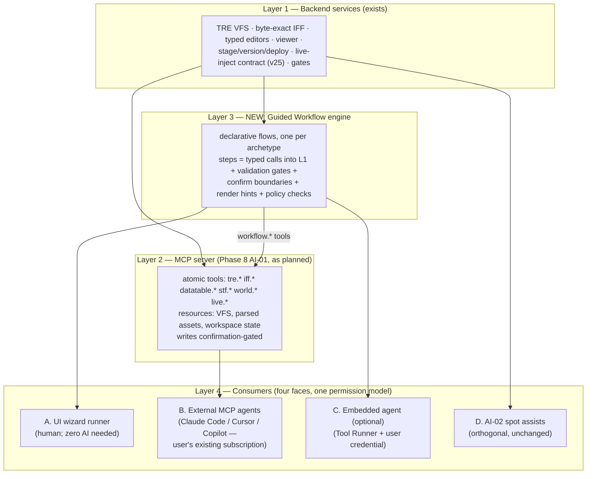

# SWG-Toolkit: Guided Mod Workflows & the Optional AI Layer

**Design proposal, 2026-08-01.** A **supplemental layer on top of the already-planned MCP
server** (SWG-Toolkit Phase 8, AI-01/AI-02): a declarative *Guided Workflow* engine that turns
the most common mod-making journeys into step-by-step wizards — driveable by a human clicking
through the UI, by any external MCP agent the user already owns (Claude Code, Cursor, Copilot),
or by an optional embedded agent using the user's own AI subscription. **Nothing beneath the
new layer changes**: same backend services, same MCP contract, same confirmation-gated write
model the existing plan mandates.

Companion doc: `asset-formats-and-modding-guide.md` (the format/composition substrate every
workflow step manipulates). Evidence: ModTheGalaxy census + server-policy web research
(2026-08-01), SWG-Toolkit `.planning` corpus, and the Claude API/Agent-embedding reference.

---

## 1. What modders actually make (demand evidence)

First real demand data gathered for this project (previous research was tool-substitution
inference only). Sources: ModTheGalaxy (12.1k members; Resources: **72 client mods, 39 tools,
24 misc, 16 server content; 21,710 downloads**; a **340-thread Requests backlog**), SWG Legends
policy coverage, Nexus's new SWG section, GitHub mod repos.

**Headline finding: the #1 download on ModTheGalaxy is a modding *tool*** (SIE, 2,291 DLs,
5.0★) — demand for *making* mods exceeds any individual mod. The most-viewed threads are all
pipeline threads (3DS Max MSH exporter 51k views, DDS plugin 33k, Max scripts 30k, TRE
Explorer 18k). The toolkit is aimed at the community's largest measured need.

Ranked archetypes (evidence in the research record):

| # | Archetype | Demand signal | Skill floor | Sides | Policy status |
|---|---|---|---|---|---|
| 1 | **UI mods** (scale/fonts/reskins/satellite maps) | Flagship community mod (No Squint) wiki-featured on Legends; CUEmu UI family; Theme Builder thread 16k views | Low-mid | Client | Allowed everywhere mods are allowed |
| 2 | **Texture reskins** (planets, buildings, armor, skies) | Largest slice of MTG client mods; DDS-plugin thread 33k views (most-walked path) | **Lowest** — the classic first mod | Client | Explicitly allowed on Legends |
| 3 | **Model/appearance swaps** (sabers, weapons, hair) | Top client-mod downloads (Unstable Blades 91 DL); dedicated "Swaps" category | Mid (no 3D skills for pure swaps) | Client | "Benign meshes" allowed |
| 4 | **Graphics packs** (ReShade presets, AI upscales) | Nexus SWG section 2025: top 3 entries | Low | Client | Tolerated broadly |
| 5 | **Sound mods** (replace/silence) | Silencer mods popular; ARP project; Legends allows all but footsteps | Low | Client | Footsteps banned (stealth exploit) |
| 6 | **QoL tweaks** (bolt speed, VB patch, keybinds) | Steady downloads incl. a perf patch at 53 DL | Mixed | Client | Exploit-line sensitive |
| 7 | **New wearables/armor variants + palettes** | Big request-thread views (13-28k), few finished releases — **undersupplied** because it needs client+server | Mid-high | **Both** | Server-dependent |
| 8 | **Server content** (quests/NPCs/planets — Core3 Lua screenplays) | Separate programmer audience; MTG Community Content Repo | High | Server (+client assets) | Server-op domain |
| 9 | **World/terrain edits** | Real but niche; SWB is the only editor; **client-side variant banned on Legends** | Expert | Both | Restricted |
| — | Housing decoration *file mods* | **Refuted** as a category — decoration is an in-game system (the toolkit's live model-D flow is the modern answer, not file mods) | | | |

**The policy dimension is load-bearing** (new finding): SWG Legends *sanctions* modding with a
launcher-integrated Mod Manager but **bans terrain, footstep-sound, collision, animation, and
interior-layout mods** (PvP exploits) while allowing textures/music/UI/benign meshes;
Restoration bans client mods outright; SWGEmu is officially restrictive, practically tolerant.
A modding product must make per-server legality a **first-class concept**, not a footnote.

Cross-scene pain points the wizards must kill: install confusion (MTG's standing answer is "use
the community mod manager"), **asset discovery** ("which .dds in which .tre is that object?" —
the #1 newbie question), hand-maintained per-resolution UI variants (no parametrization),
manual cfg/load-order editing, the 3DS-Max 3D-pipeline lock-in (Blender is the recurring ask —
already the toolkit/plugin's lane).

Precedents worth imitating: Legends' approval-pipeline Mod Manager (the distribution reality to
be compatible with), algebuckina's MTG Mod Manager (install/load-order/cfg), the **UI Color
Theme Builder** (a parametrized *generator* — 16k views validate the wizard concept), RuneLite's
reviewed Plugin Hub (cross-community model).

---

## 2. Architecture: a supplemental layer over the planned MCP stack

Alignment with existing plans (verified): Phase 8 / AI-01 already specifies an MCP server
"reusing the same backend services the UI calls" with "read-only resources + confirmation-gated
write tools"; AI-02 specifies advisory assists with diff/preview before any write;
`docs/09-ai-mcp/ai-and-mcp-integration.md` (explicitly "a direction, not a contract") names the
atomic tool surface and — crucially — declares the toolkit **"embeddable both ways"** (hosts an
MCP server; consumes AI services). The workflow layer slots directly on top; the one genuinely
new concept vs. AI-02 is *flow-driving* (multi-step guided journeys) vs. *spot assists*.



**Invariants** (these make the design safe and cheap):

1. **The AI never gets a capability the wizard doesn't have; the wizard never gets one the MCP
   tools don't have.** One service layer, one permission model, one audit trail, four faces.
2. **Flows are data, not code** — declarative definitions over existing services. Adding a
   wizard costs a flow file + any missing service endpoints (which the UI wants anyway).
3. **Confirm boundaries are shared**: where the human wizard shows a confirm button, the agent
   *must stop* and surface the same decision. This is AI-02's "diff/preview before any write"
   and the documented anti-feature ("no autonomous AI writing to live client/server") enforced
   structurally rather than by prompt.
4. **The settled boundary rule governs step rendering**: "point at the world" steps render in
   the in-game overlay; "rows/fields/text" steps render in the app. Each step declares which.

### 2.1 The flow engine

A flow definition (JSON/TS module in `packages/contracts`):

```
Flow {
  id, title, archetype, description
  prerequisites: [ServiceCheck]          // client bound? TREs mounted? live session?
  steps: [Step]
  policyProfile: PolicyRuleSet           // which server policies this flow can violate
}
Step {
  id, title, renderHint: "app" | "overlay" | "external"(Blender/image editor)
  inputs:  typed params (asset refs, files, enums) — collectable by UI form OR agent tool call
  actions: [ServiceCall]                 // the same IPC/service calls the panels use
  gate:    ValidationSpec                // round-trip, referential, CRC, policy gates
  confirm: none | "preview-diff" | "deploy" | "live-write"   // escalating boundary classes
  onFail:  remediation hint (human text + machine-readable cause)
}
```

Engine responsibilities: instantiate/resume flow state (persisted with the project, so a wizard
survives an app restart or a "go edit in Photoshop/Blender and come back" step), evaluate
gates, emit progress events (renderer + MCP notifications), and record every action into the
existing versioning model so **undo = the deploy layer's revert**, not new machinery.

### 2.2 MCP exposure (the multi-provider answer)

Alongside AI-01's atomic tools, the server exposes the flow layer:

- `workflow.list` → flows + descriptions (resource)
- `workflow.start {flowId, params?}` → instance id + first step spec
- `workflow.status {instanceId}` → current step, collected inputs, gate results
- `workflow.step {instanceId, inputs}` → runs the step up to its confirm boundary
- `workflow.confirm {instanceId, decision}` → **the only way past a boundary** — and in
  interactive contexts this surfaces the toolkit's own confirm UI to the human, so an external
  agent literally cannot self-approve a deploy/live write (the agent's `confirm` call *requests*
  confirmation; the grant comes from the user in the toolkit).

This one design move delivers "OpenAI or Cursor or Copilot keys" **without embedding any
provider SDK**: every major coding agent speaks MCP; users bring whichever agent they already
pay for; the toolkit stays provider-neutral. The AI *is* the wizard — narrating steps,
gathering inputs conversationally, calling `workflow.step` — while the toolkit keeps custody of
every write.

### 2.3 The embedded agent (optional tier C)

For the integrated in-app experience ("describe your mod, the toolkit walks you through it"),
embed a first-party agent in the Electron main process:

- **Loop:** the Anthropic TypeScript SDK's **Tool Runner** (`client.beta.messages.toolRunner`)
  over the *same* workflow/atomic tools — not the Claude Agent SDK (no filesystem/bash agent
  wanted inside the app; the tool surface should be exactly the gated toolkit surface). Per-turn
  hooks give approval gating, result inspection, and streaming out of the box.
- **Credentials (bring-your-own):**
  - *Anthropic API key* — standard `new Anthropic({apiKey})`; stored via Electron `safeStorage`
    (OS keychain), never in config files or logs.
  - *Claude subscription via OAuth profile* — the SDKs automatically resolve an `ant auth login`
    profile (zero-arg client), and short-lived tokens ride `Authorization: Bearer` + the
    `oauth-2025-04-20` beta header. The toolkit can detect an existing profile and offer
    "use your Claude login". Caveat to verify at build time: subscription-token terms of use for
    third-party apps; if disallowed, the honest UX is "connect your own agent over MCP instead"
    (tier B), which uses the subscription *through the product it's licensed for*.
  - *Other providers* — not embedded initially. Tier B covers them. If demand materializes, the
    agent loop is small enough to sit behind a provider interface, but multi-SDK maintenance is
    exactly what the MCP route avoids.
- **Cost/trust posture (hobbyist audience):** show per-flow token estimates and a running spend
  meter; default the model tier per task (cheap model for input-gathering chat, capable model
  for format-reasoning assists); everything works with AI absent — tier A is always there.
- **Model guidance** (current, from the API reference): default the embedded agent to the
  latest Opus-tier model; use adaptive thinking defaults; never hardcode dated model IDs — use
  aliases and let users override.

### 2.4 A worked example — the Texture Reskin wizard (archetype #2, lowest skill floor)

```mermaid
sequenceDiagram
    participant U as User (or Agent on user's behalf)
    participant W as Workflow engine
    participant S as Services
    U->>W: start(texture-reskin)
    W->>S: prerequisites: client bound, TREs mounted
    Note over U,W: Step 1 — "Find the asset" (overlay or app)<br/>point at object in live client (collideScreenRay)<br/>OR pick in VFS/3D viewer
    W->>S: resolve template → appearance chain → .sht → .dds list
    Note over U,W: Step 2 — pick target .dds (app; preview rendered)
    W->>S: extract to project staging; open in external editor
    Note over U,W: Step 3 — "Edit externally, come back" (external)<br/>flow persists, watches file mtime
    W->>S: gate: DDS format/mips valid, size sane
    Note over U,W: Step 4 — preview in 3D viewer / live client (confirm: preview-diff)
    Note over U,W: Step 5 — policy check (Legends: textures ✅)
    W->>S: stage → version → deploy to override (confirm: deploy)
    Note over U,W: Step 6 — optional: package as .tre + install notes (confirm)
```

Every capability referenced already exists in the toolkit or the formats guide; the wizard is
pure orchestration + the asset-discovery resolver (template→appearance→shader→texture walk),
which is itself the single highest-value new service (it answers the community's #1 question).

---

## 3. The wizard catalog (build order)

Ranked by (demand evidence × skill-floor-lowering) ÷ cost, honoring server policy:

| Tier | Wizard | Notes |
|---|---|---|
| **W1** | **Texture reskin** | Biggest walked path; exercises the asset-discovery resolver every other wizard reuses |
| **W1** | **Mod packaging + policy checker** | Terminal step of *every* flow: loose-override → .tre pack → per-server policy audit (flags Legends-restricted file classes) → install instructions / mod-manager-ready output. Ship early — it multiplies every other wizard |
| **W2** | **UI scale/theme** | Parametrized generation (resolution, scale, palette) — kills the hand-made 1080p/4K variant problem; Theme Builder demand signal |
| **W2** | **Appearance swap** | A→B swap with the appearance/CRC chain handled automatically; "Swaps" is an established category |
| **W2** | **Sound replace/silence** | Trivial engine-side; footstep-class files hard-blocked by the policy gate |
| **W3** | **Interior decoration** | Already live (model-D)! The wizard is UX packaging of the proven flow + sketch 021 |
| **W3** | **New item/prop** | Sketch 016 already designed the UI shape; depends on P1 template-compile + CSTB emitter from the formats-guide priority queue |
| **W3** | **Creature/wearable reskin** | SAT-graph closure ship-to-Blender round trip; palette variants answer the undersupplied armor-variant demand |
| **W4** | **Building edit** (POB CRC transaction), **buildout placement**, **server content scaffolding** (screenplay/convo generators — partner with Core3-side tooling), **ReShade bundler** | Demand exists; higher cost or policy-restricted — gate on earlier tiers |
| **Not planned** | Terrain wizard (expert niche + banned on the largest server), housing-decoration *file* mods (refuted — the live editor is the answer) | |

---

## 4. Delivery framing (proposal to the toolkit's planning)

1. **The workflow engine does not need to wait for Phase 8.** Tier-A wizards (human-driven)
   deliver standalone product value — arguably the largest onboarding win available — and the
   flow/step registry is the thing AI-01's MCP server then wraps. Suggested slotting: a phase
   after 05.1 ("Guided Workflows I": engine + W1 wizards), with the sketch-021 decoration modal
   treated as the first flow retrofitted into the engine.
2. **AI-01 proceeds unchanged**, adding `workflow.*` to its tool surface when it lands. Tier B
   (external agents) then works with zero additional AI engineering.
3. **Tier C (embedded agent) is a separately-shippable increment** behind a settings toggle +
   BYO credential; smallest possible first cut = conversational driver for one W1 flow.
4. **New requirements to add** (suggested): WF-01 "guided workflows for the top mod archetypes,
   fully operable without AI"; WF-02 "workflows exposed through the MCP server with
   human-custody confirmation"; AI-03 "optional embedded agent with user-supplied credentials
   can drive any workflow, stopping at every confirmation boundary".

Open items flagged for build time: subscription-OAuth licensing check (2.3); MTG/Legends
distribution partnerships (the packaging wizard should emit Legends-mod-manager-compatible
submissions); per-server policy rules need a maintained data file (policies changed as recently
as 2025-01); personas still unresearched (demand data is artifact-based — a community survey
would sharpen W2+ ordering).

---

*Mirrored to SWG-Toolkit planning inbox. Evidence details: agent research records in this
session (MTG census, Legends policy, local planning-corpus mine) and
`asset-formats-and-modding-guide.md` §8-9 for the per-step format mechanics.*
